<picture>
  <source media="(prefers-color-scheme: dark)" srcset="header.svg" />
  <source media="(prefers-color-scheme: light)" srcset="header-light.svg" />
  
</picture>

  
  
  
  

---

I build tools at the intersection of **AI** and **real-world utility** — from NLP-powered call centers to AI mentorship platforms, spatial reasoning systems to personal AI assistants. Not experiments. Things that ship.

- 🎓 **USTH** student · Deep Learning, Computer Vision, NLP, MLOps
- 🔬 Currently working on **SpatialVLM** thesis — warehouse spatial reasoning
- 🧬 Focus areas: **Biomedicine**, **bioinformatics**, **Vietnamese NLP**
- 🏗️ Philosophy: build from scratch, understand the internals, then ship

---

## What I'm Building

| Project | What it does |
|---------|-------------|
| 🔭 [**SpatialVLM**](https://github.com/ZenHKD) | Thesis — spatial reasoning for warehouse environments |
| 🤖 [**algo-sensei**](https://github.com/dige04/algo-sensei) | AI-powered DSA mentor for Claude Code — tutor, hints, review, mock interviews |
| 🧠 [**nemoclaw-stack**](https://github.com/dige04/nemoclaw-stack) | Personal AI assistant VPS infrastructure |
| 💻 [**mindspace**](https://github.com/dige04/mindspace) | AI workspace desktop app |
| 🍎 [**LimDim**](https://github.com/dige04/LimDim) | Native macOS health reminder with kawaii cloud mascot (Swift) |
| 🎬 [**video-hosting**](https://github.com/dige04/video-hosting) | Video platform with HLS streaming & AES-128 encryption |
| 💼 [**job-matcher-api**](https://github.com/dige04/job-matcher-api) | Resume-job matching with skill extraction & salary prediction |

## AI & Deep Learning

| Project | Description |
|---------|-------------|
| 🧬 [**bio-med-rag**](https://github.com/ZenHKD/bio-med-rag) | Biomedical RAG/NLP pipeline |
| 🧱 [**modern-transformer**](https://github.com/ZenHKD/modern-transformer) | Transformer implementations from scratch |
| 🌐 [**transformer-from-scratch-translation-ja-en**](https://github.com/ZenHKD/transformer-from-scratch-translation-ja-en) | JA→EN neural machine translation |
| 🎨 [**model-scratch-manga-segmentation**](https://github.com/ZenHKD/model-scratch-manga-segmentation) | YOLO-like manga panel segmentation |
| 🧬 [**crispr-offtarget**](https://github.com/ZenHKD/crispr-offtarget) | CRISPR off-target prediction with ML |
| 📄 [**ocr-vi-invoice**](https://github.com/ZenHKD/ocr-vi-invoice) | Vietnamese invoice OCR |
| 💬 [**characters-and-dialouges-association-in-comics**](https://github.com/ZenHKD/characters-and-dialouges-association-in-comics) | Comic character-dialogue NLP |

## Vietnamese NLP & Language Tech

| Project | Stack |
|---------|-------|
| [**NLPsubject**](https://github.com/dige04/NLPsubject) — AI call center | Python, NLP pipelines |
| [**job-matcher-phobert-api**](https://github.com/dige04/job-matcher-phobert-api) — Resume matching with PhoBERT | Python, FastAPI, Transformers |
| [**vietnamese-tax-law-explorer**](https://github.com/dige04/vietnamese-tax-law-explorer) — Legal document search | TypeScript |

## Finance & Quantitative

| Project | What it does |
|---------|-------------|
| [**worldquant-miner**](https://github.com/dige04/worldquant-miner) | Alpha signal generation via WorldQuant API |
| [**AI-Trader**](https://github.com/dige04/AI-Trader) | AI-driven market analysis |
| [**valuecell**](https://github.com/dige04/valuecell) | Multi-agent platform for financial applications |

---

## Tech Stack

  
  
  
  
  
  
  
  
  
  
  
  
  
  
  

---

## GitHub Stats

  
  

  
  
  

---

  <picture>
    <source media="(prefers-color-scheme: dark)" srcset="https://raw.githubusercontent.com/dige04/dige04/output/github-snake-dark.svg" />
    <source media="(prefers-color-scheme: light)" srcset="https://raw.githubusercontent.com/dige04/dige04/output/github-snake.svg" />
    
  </picture>

---

  

<i>"Build from scratch. Understand deeply. Ship relentlessly."</i>

