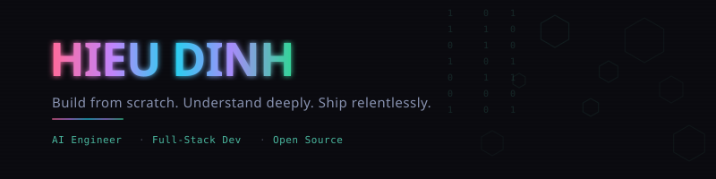

<picture>
  <source media="(prefers-color-scheme: dark)" srcset="header.svg" />
  <source media="(prefers-color-scheme: light)" srcset="header-light.svg" />
  
</picture>

<h1 align="center">Hi, I'm Hieu Dinh 👋</h1>

<p align="center">
  
</p>

<p align="center">
  <a href="https://www.linkedin.com/in/dinhthanhhieu/"></a>
  <a href="https://hieudinh.dev"></a>
  <a href="mailto:work.hieudinh@gmail.com"></a>
  <a href="https://open.spotify.com/show/6aB0v6amo3a8hgTCjlTlvh"></a>
  <a href="https://www.tiktok.com/@hieudinh.dev"></a>
</p>

```bash
hieudinh@hanoi ~ % whoami
```

```json
{
  "role":     "Agentic AI Solution Engineer @ Techvify · Hanoi, VN",
  "focus":    ["agent infrastructure", "MCP toolchains", "LLM integration", "data pipelines"],
  "building": ["OpenMem — 3-layer memory for coding agents", "agent orchestration harnesses"],
  "also":     ["GDG Hanoi organizer", "WorldQuant BRAIN research consultant", "Hieu's AI Dispatch author"],
  "creds":    "Databricks Certified Data Engineer · 2+ yrs shipping GenAI to production"
}
```
---

### 🚀 Featured Builds

| | Project | What it does |
|---|---------|--------------|
| 🧠 | **OpenMem** | 3-layer hierarchical memory for AI coding agents — SQLite FTS5 + vector hybrid search over MCP *(private, for now)* |
| 🏗️ | [**agent-harness-template**](https://github.com/dige04/agent-harness-template) | Rust harness template for long-running agent pipelines |
| 🤖 | [**seatworks**](https://github.com/dige04/seatworks) | SLPW agent team packaged as a Paseo plugin |
| 🎨 | [**mascotify**](https://github.com/dige04/mascotify) | One character image → sprite sheets, Lottie, animated WebP for iOS/Android/Unity/Godot |
| 🎬 | [**motion-shorts**](https://github.com/dige04/motion-shorts) | Local-first monorepo producing 9:16 motion-graphics shorts |
| 🏢 | [**paperclip**](https://github.com/dige04/paperclip) | Open-source orchestration for zero-human companies |
| 🗣️ | [**job-matcher-phobert-api**](https://github.com/dige04/job-matcher-phobert-api) | Vietnamese resume–job matching with PhoBERT + FastAPI |
| 📈 | [**worldquant-miner**](https://github.com/dige04/worldquant-miner) | Alpha-signal generation on the WorldQuant API |

### ✍️ Latest from the blog

- [A context window is not memory](https://hieudinh.dev/#blog/context-windows-are-not-memory)
- [Proven, Inferred, Contradicted — the Forge evidence model](https://hieudinh.dev/#blog/proven-inferred-contradicted)
- [MCP servers that agents can actually use](https://hieudinh.dev/#blog/mcp-servers-that-agents-can-actually-use)
- [Three years of GDG Hanoi](https://hieudinh.dev/#blog/three-years-of-gdg-hanoi)

### 🧰 Toolbox

<p align="center">
  
  
  
  
  
  
</p>
<p align="center">
  
  
  
  
  
  
</p>
<p align="center">
  
  
  
  
  
  
  
  
  
</p>

---

### 📊 GitHub Stats

<p align="center">
  
  
</p>

<p align="center">
  
</p>

<p align="center">
  
  
  
</p>
### 📈 Metrics

<p align="center">
  
</p>


<!-- Optional: 3D contribution wall like vumichien's —
     needs the yoshi389111/github-profile-3d-contrib GitHub Action
     to generate profile-3d-contrib/*.svg first.
<p align="center">
  <picture>
    <source media="(prefers-color-scheme: dark)"  srcset="https://raw.githubusercontent.com/dige04/dige04/main/profile-3d-contrib/profile-night-rainbow.svg" />
    <source media="(prefers-color-scheme: light)" srcset="https://raw.githubusercontent.com/dige04/dige04/main/profile-3d-contrib/profile-green-animate.svg" />
    
  </picture>
</p>
-->

### 🕸️ Contribution Network

<p align="center">
  <picture>
    <source media="(prefers-color-scheme: dark)" srcset="https://raw.githubusercontent.com/dige04/dige04/output/github-neural-contrib-dark.svg" />
    <source media="(prefers-color-scheme: light)" srcset="https://raw.githubusercontent.com/dige04/dige04/output/github-neural-contrib.svg" />
    
  </picture>
</p>

---

<p align="center">
  
</p>

<p align="center"><i>"Build from scratch. Understand deeply. Ship relentlessly."</i></p>
